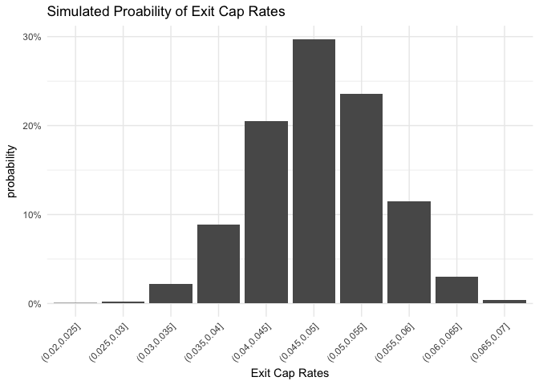
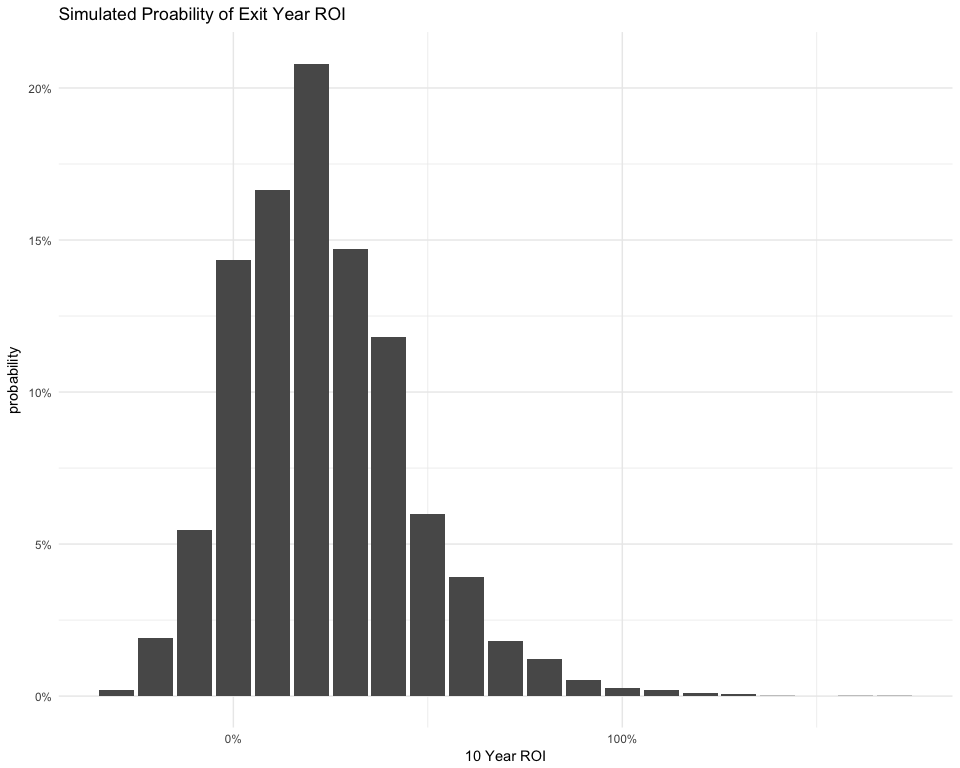

Commerical Real Estate Investment Risk Analysis using Monte Carlo Simulation
================

Your typical Commercial Real Estate underwriting model (Office, Retail, Residential, Industrial) will include numerous assumptions about the value of the asset and the future movements of the market. For example:

-   The exit cap at year 10 will be `4.5%`
-   The cost of sale will be `4.0%`
-   You annual management fees will amount to `3%` of GPI
-   Rent growth will be `4%` per year and vacancy will remain at `8%`
-   etc.

How these assumptions are produced is an alchemy of analysis, industry experience and "what looks right"-ness. Estimating assumptions is a difficult "art-more-than-science" endevour and can make or break an investment decision.

One way to enhance the investment decision making process is to introduce the concept of *quantified uncertainty* to the equation. Borrowing from statistics, we can replace point estimate assumptions with mean-value estimates and confidence intervals. An `8%` vacancy rate becomes a mean of `8%` with a standard-deviation of `0.12` and a `95% confidence interval` of `7.88%` to `8.24%`, for example.

What this allows us to do is generate ranges of probable outcomes for many assumptions. For example, this graph might represent a range of possible exit caps:


With ranges of potential assumption values, we can then simulate many potential future states based on combinations of assumption probabilities. This results in likelihood ranges for things like exit caps, sale price, IRR, ROI and more. We're also able to answer the question: How likely am I to make money on this investment?

We are going to combine univariate forecasts of some top-level underwriting assumptions with Monte Carlo simulation to generate a range of probable IRR's for a hypothetical Manhattan Office investment.

``` r
library(tidyverse)
library(stringr)
library(forecast)
library(zoo)


set.seed(608)
```

User Inputs
===========

Let us define our hypothetical investment as an Office Building purchased for `$31.5M` in year T with the intent of selling the building at year T+10. The building currently generates `$1.2M` in operating income. We will also set our number of simulations to 10,000.

``` r
# a fictitious purchase price
purchase_price <- 31500000

# years to hold the property
year_hold <- 10

# current year NOI
current_NOI <- 1200000

# input the number simulations to run
n_sims <- 10000
```

Our hypothetical purchase cap rate is 3.81%.

Exit Caps
=========

``` r
# Exit Cap data from RCA
RCA_trxns <- read_csv("data/RCA_manhat_office_trxs.csv")

RCA_trxns <- RCA_trxns %>% mutate(Date = as.Date(Date, format = "%m/%d/%y"))

manhat_office_caps <- 
  RCA_trxns %>% select(`Cap Rate`, Date) %>% filter(!is.na(`Cap Rate`)) %>% 
  mutate(Year = lubridate::year(Date)
         , Month = lubridate::month(Date)
         , YearMonth = as.Date(paste(Year,Month,"01",sep="-"), format = "%Y-%m-%d"))

head(manhat_office_caps)
```

    ## # A tibble: 6 x 5
    ##   `Cap Rate`       Date  Year Month  YearMonth
    ##        <dbl>     <date> <dbl> <dbl>     <date>
    ## 1 0.04800000 2017-07-24  2017     7 2017-07-01
    ## 2 0.03900000 2017-06-20  2017     6 2017-06-01
    ## 3 0.06280000 2017-06-01  2017     6 2017-06-01
    ## 4 0.03900000 2017-05-24  2017     5 2017-05-01
    ## 5 0.05217554 2017-05-05  2017     5 2017-05-01
    ## 6 0.04900000 2017-04-05  2017     4 2017-04-01

Forecasting exit cap rates out 10 years
---------------------------------------

``` r
cap_rate_means <- 
  manhat_office_caps %>% 
  group_by(YearMonth) %>% 
  summarise(Mean_cap = mean(`Cap Rate`, na.rm = T)
           , SD_cap = sd(`Cap Rate`, na.rm = T)
           , count = n()
           ) %>% 
  mutate(SD_cap = zoo::na.locf(SD_cap, na.rm = T))

# visualize exit cap rates and standard deviations over time (Office, Manhattan)
cap_rate_means %>% 
  mutate(upper_sd = Mean_cap+SD_cap, lower_sd = Mean_cap - SD_cap) %>% 
  ggplot()+
  aes(x = YearMonth, y = Mean_cap)+
  geom_ribbon(aes(ymin = lower_sd, ymax = upper_sd), alpha = 0.5, fill = "skyblue")+
  geom_line(size = 2, color = "black")
```


``` r
# forecasting exit cap rates 10 years
cap_rate_means_ts <- ts(cap_rate_means$Mean_cap, start = c(2007,7), end = c(2017,7), frequency = 12)
mod <- cap_rate_means_ts %>% smooth() %>% auto.arima()
cap_for <- forecast(cap_rate_means_ts, model = mod, h = 12*year_hold)
plot(cap_for)
```


``` r
# extract the point forecasts into a dataframe
# 95% CI is 2 standard deviations, so, 95% CI/2  = one SD
date_seq <- seq.Date(from = as.Date("08-2017-01", format = "%m-%Y-%d")
                     , to = as.Date("07-2027-01", format = "%m-%Y-%d")
                     , by= "month")

cap_forc_data <- 
  tibble("YearMonth" = date_seq
         , "Mean_cap" = as.numeric(cap_for$mean)
         , "SD_cap" = as.numeric(cap_for$upper[,2]-as.numeric(cap_for$mean))/2
         ) %>% 
  mutate("Lower_bound" = Mean_cap - SD_cap, "Upper_bound" = Mean_cap + SD_cap) 

# visualize the forecasts + SD
cap_forc_data %>% 
  ggplot()+
  aes(x = YearMonth, y = Mean_cap, ymin = Lower_bound, ymax = Upper_bound)+
  geom_ribbon(alpha = 0.5, fill = "skyblue")+
  geom_line(size = 2, color = "black")+
  theme_minimal()
```


Forecasting Rent Growth
=======================

``` r
# Office rent data from CoStar
costar_manhat_office <- read_csv("data/Costar_office_manhat_stats.csv")

office_rents <- 
  costar_manhat_office %>% 
  filter(Quarter!="QTD") %>% 
  mutate(Year = str_replace(Quarter," Q[0-9]","")
         , Quart = str_extract(Quarter,"Q[0-9]")
         , YearQuarter = lubridate::yq(paste(Year,Quart))
         ) %>% 
  select(YearQuarter,`Office Gross Rent Overall`) %>% 
  arrange(YearQuarter) %>% 
  mutate(QoQ = (`Office Gross Rent Overall`-lag(`Office Gross Rent Overall`,1))/lag(`Office Gross Rent Overall`,1)) %>% 
  mutate(QoQ = if_else(is.na(QoQ),0,QoQ)) %>% 
  mutate(Cumlative_RG = cumsum(QoQ))

head(office_rents)
```

    ## # A tibble: 6 x 4
    ##   YearQuarter `Office Gross Rent Overall`          QoQ Cumlative_RG
    ##        <date>                       <dbl>        <dbl>        <dbl>
    ## 1  1996-07-01                       27.67  0.000000000   0.00000000
    ## 2  1996-10-01                       26.87 -0.028912179  -0.02891218
    ## 3  1997-01-01                       27.96  0.040565687   0.01165351
    ## 4  1997-04-01                       28.16  0.007153076   0.01880658
    ## 5  1997-07-01                       28.40  0.008522727   0.02732931
    ## 6  1997-10-01                       29.86  0.051408451   0.07873776

Visualizig office rent growth
-----------------------------

``` r
office_rents %>% 
  ggplot()+
  aes(x = YearQuarter, y = QoQ)+
  geom_col()+
  geom_line(aes(y = Cumlative_RG))+
  theme_minimal()+
  labs(title = "Manhattan Office Quarterly Rent Growth"
       , y = NULL
       , x = NULL)
```


Forecasting cumulative rent growth over 10 years
------------------------------------------------

``` r
rent_growth_means_ts <- ts(office_rents$Cumlative_RG, start = c(1996,3), end = c(2017,2), frequency = 4)

fit <- stl(rent_growth_means_ts, s.window="periodic", t.window = 4, l.window = 10)
fcast <- forecast(fit, method="naive", h = 4*year_hold)
plot(fcast)
```


``` r
# extract the point forecasts into a dataframe
# 95% CI is 2 standard deviations, so, 95% CI/2  = one SD
date_seq2 <- seq.Date(from = as.Date("07-2017-01", format = "%m-%Y-%d"), to = as.Date("04-2027-01", format = "%m-%Y-%d"), by= "quarter")
rent_forc_data <- 
  tibble("YearMonth" = date_seq2
         , "Mean_rent" = as.numeric(fcast$mean)
         , "SD_rent" = (fcast$upper[,2]-fcast$mean)/2
         ) %>% 
  mutate("Lower_bound" = Mean_rent - SD_rent, "Upper_bound" = Mean_rent + SD_rent) 


# adjust rent growth data so that it is growth relative to today
set.seed(2017)
rent_forc_data <- 
  rent_forc_data %>% 
  mutate(rent_adj = (row_number()*0.5)*rnorm(n = nrow(rent_forc_data), mean = 0.5, sd = 0.2)) %>% 
  mutate(rent_adj = rnorm(n = nrow(rent_forc_data), mean = 0.5, sd = 0.3)) %>% 
  mutate(Mean_rent = Mean_rent + rent_adj, SD_rent = SD_rent + rent_adj, Lower_bound = Lower_bound + rent_adj, Upper_bound = Upper_bound + rent_adj) %>% 
  mutate_at(vars(Mean_rent:Upper_bound), .funs = function(x) x - (office_rents$Cumlative_RG[which(office_rents$YearQuarter==max(office_rents$YearQuarter))])) 

# visualize the forecasts + SD
rent_forc_data %>% 
  ggplot()+
  aes(x = YearMonth, y = Mean_rent, ymin = Lower_bound, ymax = Upper_bound)+
  geom_ribbon(alpha = 0.5, fill = "skyblue")+
  geom_line(size = 2, color = "black")+
  theme_minimal()
```



Generating simulations
======================

``` r
# isolate the exit year:
exit_year_data_cap <- cap_forc_data %>% filter(row_number()==year_hold*12) #monthly
exit_year_data_rents <- rent_forc_data %>% filter(row_number()==year_hold*4) #quarterly
```

Simulation of cap rates
-----------------------

``` r
exit_caps_sim <- abs(rnorm(n = n_sims, mean = exit_year_data_cap$Mean_cap, sd = exit_year_data_cap$SD_cap))

exit_caps_sim %>% 
  as_data_frame() %>% 
  mutate(buckets = cut(value,breaks = seq(0,max(.),by=0.005))) %>% 
  group_by(buckets) %>% 
  summarise(count = n()) %>% 
  filter(!is.na(buckets)) %>% 
  mutate(probability = count/sum(count)) %>% 
  ggplot()+
  aes(x = buckets, y = probability)+
  geom_col()+
  theme_minimal()+
  theme(axis.text.x = element_text(angle = 45, hjust = 1))+
  scale_y_continuous(labels = scales::percent)+
  labs(title = "Simulated Proability of Exit Cap Rates"
       , x = "Exit Cap Rates")
```


Simulation of rent growth:
--------------------------

``` r
exit_year_rents_sim <- rnorm(n = n_sims, mean = exit_year_data_rents$Mean_rent, sd = abs(exit_year_data_rents$SD_rent))
```

``` r
exit_year_rents_sim %>% 
  as_data_frame() %>% 
  filter(is.finite(value)) %>% 
  mutate(buckets = cut(value
                       ,breaks = seq(from = 0, to = range(exit_year_rents_sim)[2],by=0.05)
                       )
         ) %>% 
  group_by(buckets) %>% 
  summarise(count = n()) %>% 
  filter(!is.na(buckets)) %>% 
  mutate(probability = count/sum(count)) %>% 
  ggplot()+
  aes(x = buckets, y = probability)+
  geom_col()+
  theme_minimal()+
  theme(axis.text.x = element_text(angle = 45, hjust = 1))+
  scale_y_continuous(labels = scales::percent)+
  labs(title = "Simulated Proability of Rent Growth Rate"
       , x = "Rent Growth")
```


Simulation of NOI:
------------------

``` r
exit_year_noi_sim <- (exit_year_rents_sim*current_NOI)+current_NOI

exit_year_noi_sim  %>% 
  as_data_frame() %>% 
  mutate(buckets = cut(value,breaks = seq(0,max(.),by=250000)
                       )
         ) %>% 
    group_by(buckets) %>% 
    summarise(count = n()) %>% 
    filter(!is.na(buckets)) %>% 
    mutate(probability = count/sum(count)) %>% 
    ggplot()+
    aes(x = buckets, y = probability)+
    geom_col()+
    theme_minimal()+
    theme(axis.text.x = element_text(angle = 45, hjust = 1))+
    scale_y_continuous(labels = scales::percent)+
    labs(title = "Simulated Proability of Exit Year NOI"
         , x = "NOI ($ Millions)")
```


Simulation of sales price
-------------------------

``` r
sale_price_sim <- exit_year_noi_sim/exit_caps_sim

summary(sale_price_sim)
```

    ##     Min.  1st Qu.   Median     Mean  3rd Qu.     Max. 
    ## 20716024 33823843 37933148 38672910 42600392 83666633

``` r
sale_price_sim %>% 
 as_data_frame() %>% 
  mutate(buckets = cut(value, breaks = seq(0,max(.),by=10000000))) %>% 
    group_by(buckets) %>% 
    summarise(count = n()) %>% 
    filter(!is.na(buckets)) %>% 
    mutate(probability = count/sum(count)) %>% 
    ggplot()+
    aes(x = buckets, y = probability)+
    geom_col()+
    theme_minimal()+
    theme(axis.text.x = element_text(angle = 45, hjust = 1))+
    scale_y_continuous(labels = scales::percent)+
    labs(title = "Simulated Proability of Exit Year Sales Price"
         , x = "Exit Sale Price")
```


Simualtion of Return On Investment
==================================

``` r
ROI <- round((sale_price_sim - purchase_price)/purchase_price,2)

ROI %>% 
  as_data_frame() %>% 
  mutate(buckets = round(value,1)) %>% 
  group_by(buckets) %>% 
  summarise(count = n()) %>% 
  filter(!is.na(buckets)) %>% 
  mutate(probability = count/sum(count)) %>% 
  ggplot()+
  aes(x = buckets, y = probability)+
  geom_col()+
  theme_minimal()+
  scale_x_continuous(breaks = seq(0,6,by=1), labels = scales::percent)+
  scale_y_continuous(labels = scales::percent)+
  labs(title = "Simulated Proability of Exit Year ROI"
       , x = "10 Year ROI")
```



Of course, it wouldn't take much additional work to calculate probable IRR's or other investment metrics.
